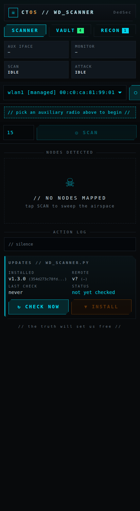
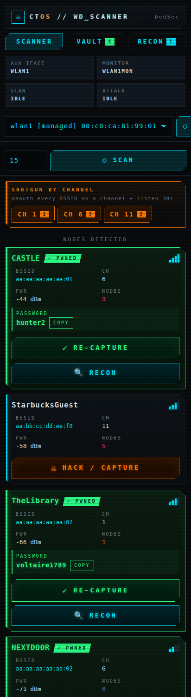
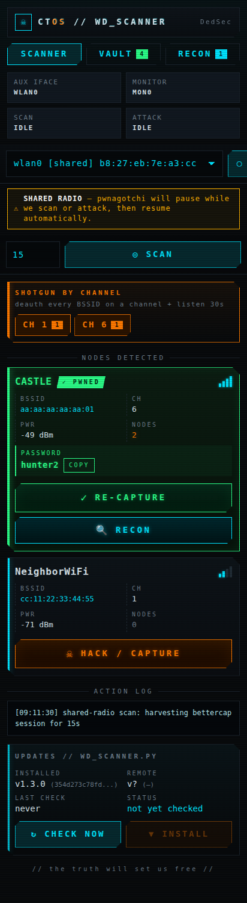
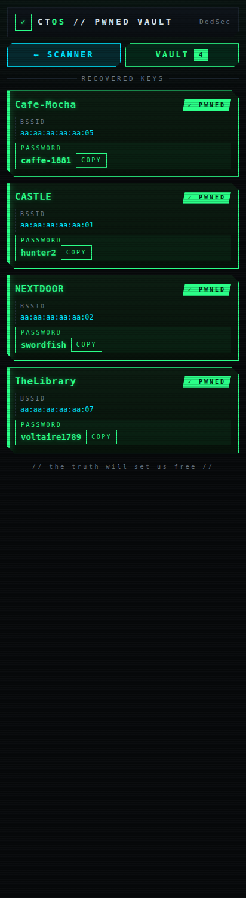
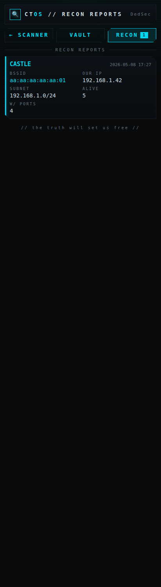
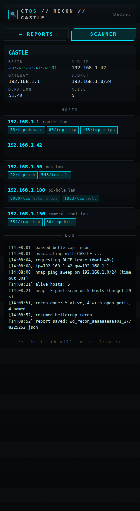

# wd_scanner

A [pwnagotchi](https://pwnagotchi.ai) plugin with a Watch Dogs / DedSec
themed mobile UI for picking Wi-Fi targets, sending deauth, capturing
handshakes into pwnagotchi's normal pipeline, and (for networks the
existing crackers have already broken) **logging in with the known
password and running a basic LAN recon**.

Works on **two-radio** rigs (USB monitor dongle + onboard) and on
**single-radio** rigs (Pi Zero W with just `wlan0`) by politely pausing
pwnagotchi for the duration of an attack/recon and resuming when done.

---

## Screenshots

| First-run / no radio | Scan results + per-channel SHOTGUN |
|---|---|
|  |  |

| Single-radio (shared) mode | Pwned vault |
|---|---|
|  |  |

| Recon report list | Recon report detail |
|---|---|
|  |  |

The UI is mobile-first: stacked cards, 44–48 px tap targets, sticky
toolbar, no horizontal scroll. Tested on iOS Safari and Android Chrome
over USB tether at `http://10.0.0.2:8080`.

---

## What it does

### 1. Pick a radio at runtime

A dropdown enumerates every wireless device fresh on every page render.
Replug a USB dongle and it shows up under whatever name the kernel gives
it. Each option is tagged `[managed]`, `[monitor]` or `[shared]`. Shared
radios are the ones that live on the same `phy` as pwnagotchi's main
radio — selectable, but using one means pwnagotchi pauses while we
work.

### 2. Scan

Tap **SCAN**. On a dedicated radio the plugin runs `airodump-ng` and
aggregates SSIDs / BSSIDs / channels / RSSI / client counts. On a shared
radio it polls bettercap's session for the same data (no second monitor
vif on the same radio).

Results are listed strongest-first with signal pips, channel, RSSI, a
heat-coded client count, and — if pwnagotchi has already cracked the
network — the recovered password inline (with a COPY button).

### 3. Single-target attack

Tap **HACK / CAPTURE** (or **RE-CAPTURE** on a known network):

1. Pin pwnagotchi's main radio to the target's channel (`wifi.recon.channel`).
2. Send N bursts of `wifi.deauth <BSSID>` (default 5, 2 s apart).
3. Sleep `deauth_listen_seconds` (default 30 s) so bettercap can record
   the 4-way handshake into `bettercap.handshakes`.
4. Release the pin so pwnagotchi resumes hopping.

The pcap lands in the same folder pwnagotchi already uploads from — your
existing crackers (quickdic, wpa-sec, online-hashcrack, etc.) just run
as normal.

### 4. Channel shotgun (mass deauth)

Below the SCAN button there's a **shotgun by channel** strip with one
chip per channel that has APs in the current scan, e.g. `CH 6 [4]`,
`CH 11 [2]`. Tap one to:

1. Pin the radio to that channel.
2. Round-robin a deauth burst at every BSSID on it (default 3 rounds,
   so the first BSSID isn't done before the last is touched — this
   wakes more clients in parallel).
3. Listen `shotgun_listen_seconds` (default 30 s) for the resulting
   reauth 4-ways.
4. Hand control back to bettercap.

It's noisy on purpose. Maximises catches per minute on a busy channel.

### 5. Recon on pwned networks

PWNED cards get a second button below RE-CAPTURE: **🔍 RECON**. Tapping
it kicks a worker that:

1. Pauses bettercap (`wifi.recon off`).
2. Switches the chosen radio out of monitor mode and into managed.
3. Brings up `wpa_supplicant` with the SSID + recovered PSK.
4. `dhclient` for an IPv4 lease (timeout = `recon_dhcp_dwell`, default 8 s).
5. Reads our IP + the default gateway, derives the subnet (always
   clamped to /24 so the sweep is finite).
6. `nmap -sn` ping sweep across the subnet.
7. `nmap -Pn -F --open` top-100-port scan against alive hosts.
8. `getent hosts` / reverse DNS for each.
9. Saves the whole result as a JSON report
   `wd_recon_<bssid>_<ts>.json` next to the handshakes.
10. Tears it all down: stop dhclient, kill wpa_supplicant, switch the
    iface back to monitor, resume bettercap.

The total wall-clock time is bounded by `recon_seconds` (default 60 s).
Disconnect happens as soon as the scan finishes, regardless of success.

The reports are listed in a sub-page at `/plugins/wd_scanner/recon`
(linked from the **RECON** nav button on the main screen, with a count
badge); each report opens to a detail view showing BSSID / our IP /
gateway / subnet / duration, then per-host ports + reverse-DNS names,
plus the full action log.

### 6. Auto-update

`on_internet_available` checks GitHub for a newer copy of the plugin
(default once a day). New bytes are validated (parse, identity guard,
size sanity), backed up to `wd_scanner.py.bak`, and atomically swapped
in. The UI shows a pulsing **RESTART REQUIRED** banner — the plugin
never restarts pwnagotchi for you.

---

## Install

### 1. Drop the file in pwnagotchi's custom plugins folder

On the pwnagotchi (default user `pi`, default address `10.0.0.2` over USB):

```bash
ssh pi@10.0.0.2

sudo wget -O /usr/local/share/pwnagotchi/custom-plugins/wd_scanner.py \
  https://raw.githubusercontent.com/Deloril/pwn-plugins/main/wd_scanner/wd_scanner.py

sudo chown root:root /usr/local/share/pwnagotchi/custom-plugins/wd_scanner.py
sudo chmod 644 /usr/local/share/pwnagotchi/custom-plugins/wd_scanner.py
```

(Verify the destination matches `main.custom_plugins` in
`/etc/pwnagotchi/config.toml`.)

### 2. Enable it in `config.toml`

```toml
main.plugins.wd_scanner.enabled = true

# All optional — defaults shown.
main.plugins.wd_scanner.scan_seconds = 15            # default scan length
main.plugins.wd_scanner.deauth_listen_seconds = 30   # capture window for 1-target attack
main.plugins.wd_scanner.deauth_bursts = 5            # bursts per attack
main.plugins.wd_scanner.allow_shared = true          # let single-radio rigs share

# Channel shotgun
main.plugins.wd_scanner.shotgun_listen_seconds = 30
main.plugins.wd_scanner.shotgun_burst_per_bssid = 3

# Recon
main.plugins.wd_scanner.recon_seconds = 60           # total nmap budget
main.plugins.wd_scanner.recon_dhcp_dwell = 8         # dhclient timeout
main.plugins.wd_scanner.recon_subnet_max = 256       # cap alive-host count

# Auto-update
main.plugins.wd_scanner.update_url = "https://raw.githubusercontent.com/Deloril/pwn-plugins/main/wd_scanner/wd_scanner.py"
main.plugins.wd_scanner.update_check_interval = 86400  # 24h
main.plugins.wd_scanner.update_auto_install = true
```

### 3. Restart pwnagotchi

```bash
sudo systemctl restart pwnagotchi
sudo journalctl -u pwnagotchi -f | grep wd_scanner
```

You should see something like:

```
[wd_scanner] loaded v1.3.0; pick an aux radio from /plugins/wd_scanner/
[wd_scanner] agent ready, plugin armed.
```

### 4. Open the UI

```
http://10.0.0.2:8080/plugins/wd_scanner/
```

---

## Dependencies

Already on a stock pwnagotchi image:

- `aircrack-ng` (`airodump-ng`, `airmon-ng`)
- `iw`
- `bettercap` (driven by pwnagotchi)

For the recon feature you also need `wpa_supplicant`, `dhclient`, and
`nmap`. On a stock image:

```bash
sudo apt-get install -y wpasupplicant isc-dhcp-client nmap
```

If any of these are missing the plugin logs a clear message and the
recon button becomes a no-op (everything else still works).

---

## URL reference

| Path | Method | What it does |
|---|---|---|
| `/plugins/wd_scanner/` | GET | Main scanner UI |
| `/plugins/wd_scanner/pwned` | GET | Pwned vault |
| `/plugins/wd_scanner/recon` | GET | List of recon reports |
| `/plugins/wd_scanner/recon/<file>.json` | GET | Single report detail |
| `/plugins/wd_scanner/status.json` | GET | Full machine-readable state |
| `/plugins/wd_scanner/pwned.json` | GET | Just the recovered keys |
| `/plugins/wd_scanner/select` | POST `interface=…` | Pick aux radio |
| `/plugins/wd_scanner/release` | POST | Release the aux radio |
| `/plugins/wd_scanner/scan` | POST `seconds=…` | Start a scan |
| `/plugins/wd_scanner/deauth` | POST `bssid=…&channel=…&ssid=…` | Single-target attack |
| `/plugins/wd_scanner/shotgun` | POST `channel=…` | Channel shotgun |
| `/plugins/wd_scanner/recon` | POST `bssid=…&ssid=…` | Connect + nmap recon |
| `/plugins/wd_scanner/check_update` | POST | Force-check GitHub |
| `/plugins/wd_scanner/install_update` | POST | Force-install update |

---

## Troubleshooting

| Symptom | Likely cause | Fix |
|---|---|---|
| 404 on `/plugins/wd_scanner/` | Plugin didn't load | `journalctl -u pwnagotchi -e \| grep wd_scanner` |
| "monitor mode unavailable" | Driver doesn't support monitor, or process holding iface | `sudo airmon-ng check kill` then retry |
| Scan returns 0 nodes (dedicated) | Aux radio asleep / blocked by `rfkill` | `sudo rfkill unblock all` |
| Scan returns 0 nodes (shared) | Pwnagotchi hasn't seen any APs yet | Wait a minute for bettercap to populate its session |
| Deauth runs but no handshakes | AP has 802.11w (PMF) on, or no clients in range | Try a different target with clients ≥ 1 |
| Recon: "no IPv4 acquired" | DHCP didn't reply within `recon_dhcp_dwell` seconds | Bump `recon_dhcp_dwell` to 15 |
| Recon: "wpa_supplicant/dhclient missing" | One of the dependencies isn't installed | `apt-get install -y wpasupplicant isc-dhcp-client nmap` |
| Recon report shows no ports | Hosts blocked top-100 / `nmap -F` skipped them | Increase `recon_seconds` for a deeper scan |
| Pwned vault is empty even though I have cracked networks | Crackers writing elsewhere | Verify `bettercap.handshakes` matches your cracker's output dir |

---

## Legal

Only use this against networks you own or have explicit written
permission to test. Sending deauth frames at networks you don't control
is illegal in most jurisdictions, including the US and UK. Connecting
to networks (even with their published password) without permission is
a separate offence in many places.

The author offers this for research and educational use on networks you
control. You are responsible for what you do with it.

## License

GPLv3 — same as pwnagotchi itself.
